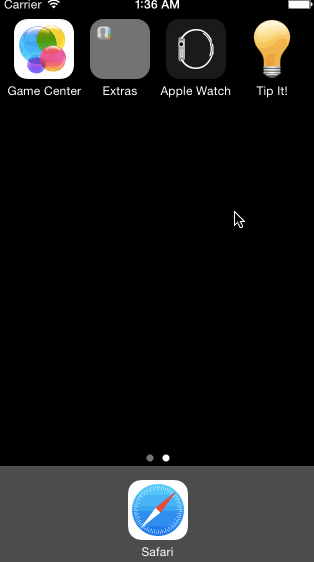

# Tip It! (Swift)

This iOS app helps you do math for tips. It's also the [pre-assignment](https://gist.github.com/timothy1ee/7747214) requirement for CodePath.

Time spent: 10 hours

Completed by xke:

* [x] Required: User can enter a bill amount, choose a tip percentage, and see the tip and total values.
* [x] Required: Settings page to change the default tip percentage.
* [x] Optional: Making sure the keyboard is always visible and the bill amount is always the first responder. This way the user doesn't have to tap anywhere to use this app. Just launch the app and start typing.

* [x] Bonus: Sliders for easier input of tip percentage
* [x] Bonus: Autolayout to center elements on larger-width screens
* [x] Bonus: Setting to make keyboard always visible, or not
* [x] Bonus: App icons (with help from makeappicons.com)

Video walkthrough (captured with licecap):

Notes:

* Tested on simulator for iPhone 4, 5, 6, and iPad in portrait (vertical) mode. 
* Landscape (horizontal) mode is currently disabled, since bottom elements will otherwise cut off from screen. Will need to learn about how to correctly integrate ScrollView to be able to support landscape mode.

